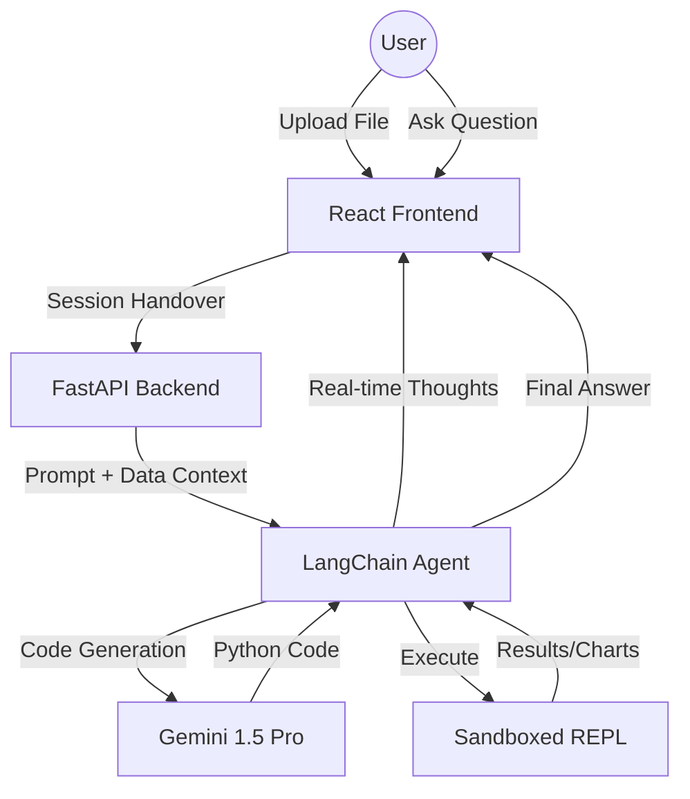

<div align="center">


<br/>

# 📊 StatBot Pro
### *Autonomous Data Analysis Engine for CSV & Excel*

**StatBot Pro** is an AI-powered platform that transforms raw spreadsheets into actionable insights. Using **Gemini 1.5 Pro** and **LangChain**, it autonomously writes, debugs, and executes Python code in a secure sandbox to answer your data questions and generate high-quality visualizations.

[**Documentation**](#-documentation) • [**Features**](#-key-features) • [**Architecture**](#-architecture) • [**Setup**](#-quick-start)

</div>

---

## 🚀 Key Features

- **🤖 Autonomous Agent**: Unlike simple chatbots, StatBot Pro uses a reasoning agent that designs its own analysis plan, writes Pandas code, and self-corrects if it encounters errors.
- **📈 Live Visualization**: Automatically generates Matplotlib and Seaborn charts which are served directly in the chat interface.
- **🧠 Transparent Reasoning**: Watch the AI's "Thought Process" in real-time via a streaming SSE (Server-Sent Events) interface.
- **🔒 Secure Sandboxing**: All AI-generated code is executed in an isolated Python REPL with strict import whitelists and blocked system-level operations.
- **📂 Universal Support**: Native support for `.csv`, `.xls`, and `.xlsx` file formats.
- **⚡ Modern UI/UX**: Premium dark interface built with React 18, Framer Motion, and Tailwind-inspired custom CSS.

---

## 🏗️ Architecture



---

## 🛠️ Tech Stack

| Layer | Responsibility | Technology |
|---|---|---|
| **AI Engine** | LLM & Reasoning | **Google Gemini 1.5 Pro** |
| **Framework** | Agentic Orchestration | **LangChain** |
| **Backend** | API & Streaming | **FastAPI** |
| **Data Engine** | Processing & Math | **Pandas, NumPy** |
| **Viz Engine** | Charting | **Matplotlib, Seaborn** |
| **Frontend** | Interface | **React 18, Vite** |
| **Styling** | Aesthetics | **Vanilla CSS (Premium Design System)** |
| **Sandbox** | Security | **Custom REPL Whitelist** |

---

## 🔒 Security Model

StatBot Pro is built with a **Security-First** approach. AI-generated code is never given raw access to the host system:

1.  **Import Whitelist**: Only data science libraries (Pandas, NumPy, etc.) are permitted.
2.  **Pattern Blacklist**: Operations like `os.system`, `subprocess`, `open()`, and `eval()` are blocked at the source.
3.  **Chart Interception**: `plt.show()` is automatically patched to save images to an isolated directory rather than opening a display window.
4.  **Network Isolation**: The execution environment has no outbound internet access.

---

## ⚡ Quick Start

### 1. Configure
Create a `.env` file in the root directory:
```env
GOOGLE_API_KEY=your_gemini_api_key_here
```

### 2. Backend Setup
```bash
cd backend
pip install -r requirements.txt
python main.py
```

### 3. Frontend Setup
```bash
cd frontend
npm install
npm run dev
```

---

<div align="center">

Built with ❤️

</div>
